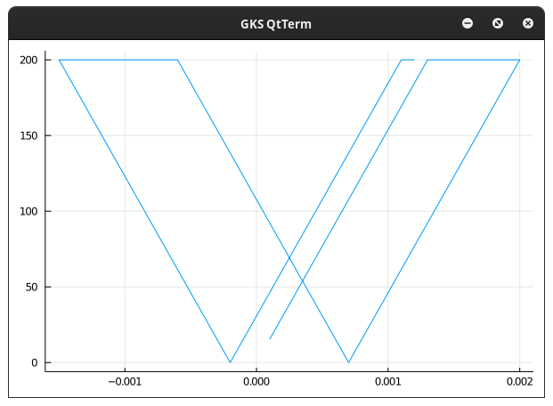

# SmallStrainPlastic Documentation

SmallStrainPlastic is a library that aims to simplify the addition of different plastic models. The usage may be for a material point to judge the behaviour of a plastic model or to in a finite element model to simulate the behaviour of a plastic material.

The assumptions made while developing the library are the following:

The flow rule for plastic strain is considered to be:

𝛆̇ᵖ = λ̇  Θ(𝛔, 𝐪)

The flow rule for internal variable is considered to be:

𝛂̇ = λ̇  𝐡(𝛔, 𝐪)

The stress is considered as:

𝛔 = ℂ:(𝛆 - 𝛆ᵖ)

The hardening variable is considered as:

𝐪 = - 𝓗(𝛂)

Special Unicode characters using eg: "\bb*", "\bf*", or "\bsrc*" are used to define functions. It is highly recommended such unicode characters are avoided when defining internal variables to avoid confusion.

## Plasticity Model

```@docs
	SmallStrainPlastic.PlasticModel
```

## State of Plasticity

```@docs
	SmallStrainPlastic.State
```

```@docs
	SmallStrainPlastic.createStateDict
```

```@docs
	SmallStrainPlastic.updateStateDict!
```

```@docs
	SmallStrainPlastic.getState!
```
## Easier Finding of Jacobians

```@docs
	SmallStrainPlastic.denseJacobian!
```

```@docs
	SmallStrainPlastic.denseJacobian
```
## Return Mapping Alogrithm

```@docs
	SmallStrainPlastic.returnMapping!
```
### An example using J2 Plastic Model

	using SmallStrainPlastic, Plots
	function testJ2()
    	σ_y = 200.0
    	E = 200e3
    	ν = 0.3
    	plasticVars =SmallStrainPlastic.initPlasticVars(SmallStrainPlastic.j2Model)
	  	plasticVars.C = SmallStrainPlastic.createVoigtElasticTensor(E, ν)
    	params_J2 = SmallStrainPlastic.initParams_j2(σ_y, 0.0)
		𝒑Array::Array{Float64, 1} = zeros(0)
    	𝒒Array::Array{Float64, 1} = zeros(0)
    	𝒆Array::Array{Float64, 1} = zeros(0)
    	𝒆ₛArray::Array{Float64, 1} = zeros(0)
    	for i ∈ 1:82
        		if (i<=20)
            		plasticVars.ϵ[1] += 1e-4
        		elseif (i>20 && i<=55)
            		plasticVars.ϵ[1] -= 1e-4
        		else
           		 	plasticVars.ϵ[1] += 1e-4
        		end
        		SmallStrainPlastic.checkPlasticState!(plasticVars, SmallStrainPlastic.j2Model, params_J2, 1, 1)
       		 𝒑, 𝒒 = SmallStrainPlastic.get_𝒑_𝒒(plasticVars.σ_voigt)
        		push!(𝒑Array, 𝒑)
        		push!(𝒒Array, 𝒒)
        		𝒆, 𝒆ₛ = get_𝒆_𝒆ₛ(plasticVars.ϵ)
        		push!(𝒆Array, 𝒆)
       		push!(𝒆ₛArray, 𝒆ₛ) 
    	end
    	plot(𝒆Array, 𝒒Array, legend=false)#, seriestype = :scatter)
	end
	
You should get a plot like this:

	
